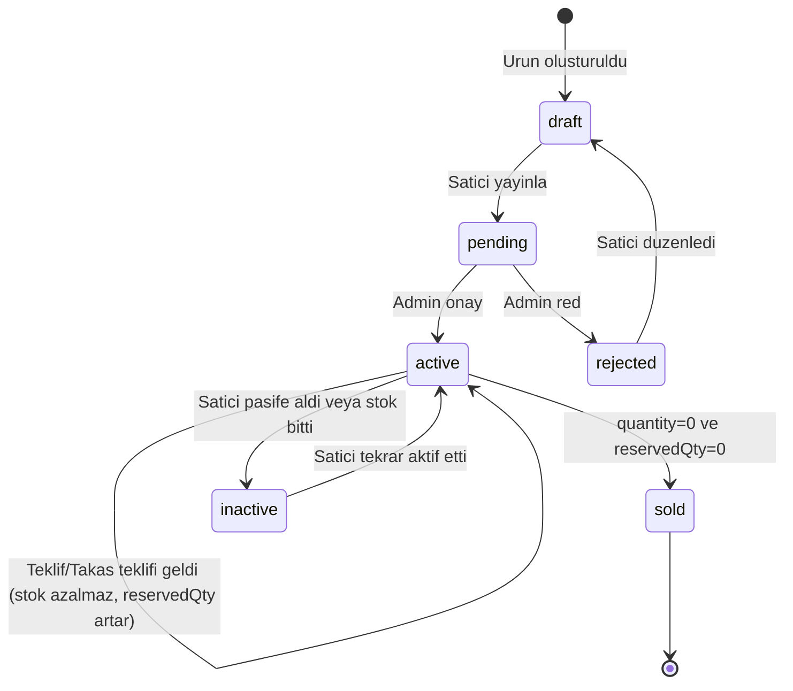
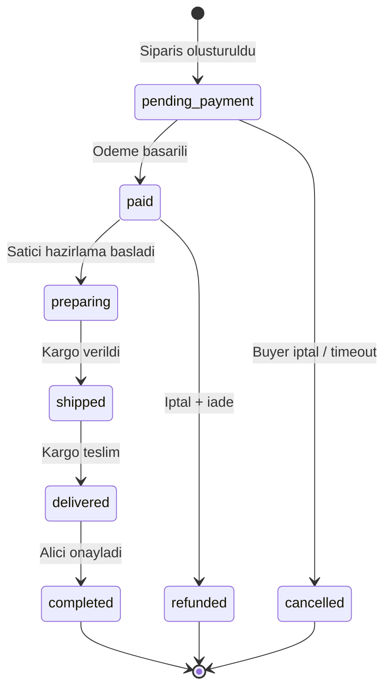
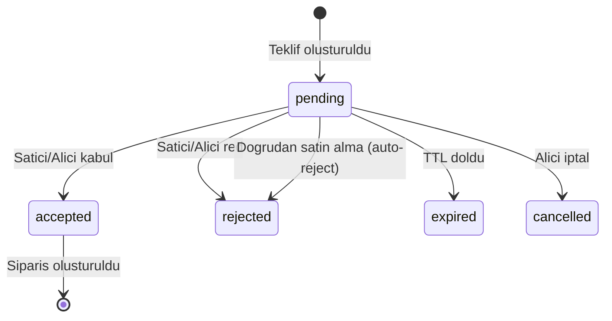
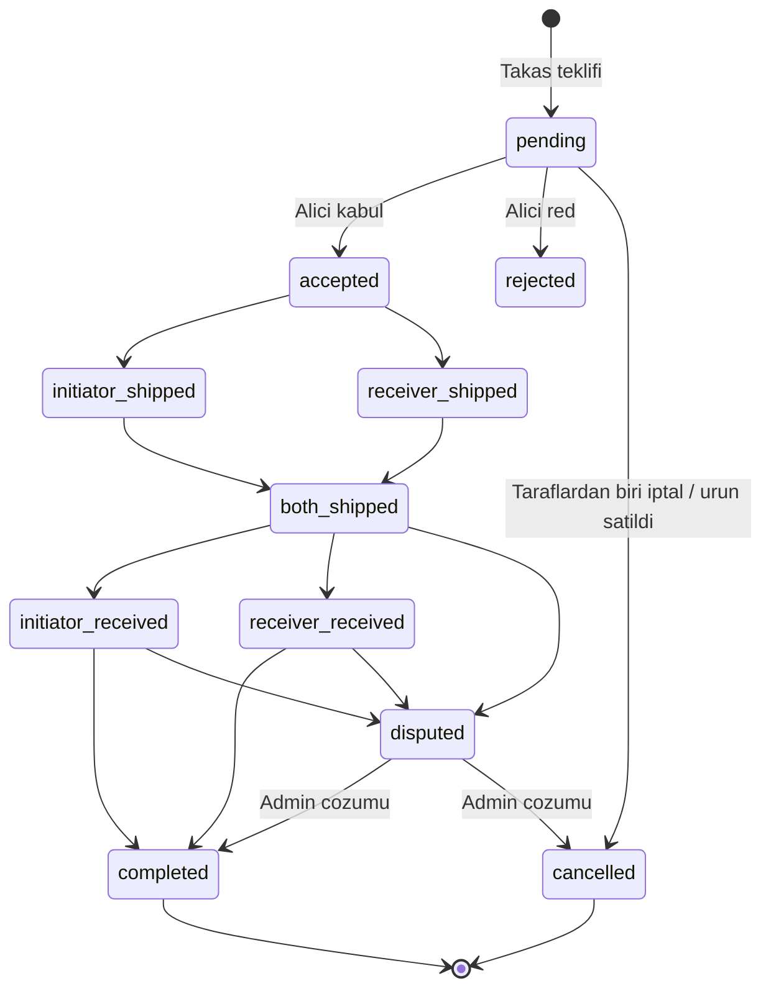

# Purchase / Offer / Trade Sistem Tasarimi ve Akis Dokumantasyonu

## MEVCUT DURUM ANALIZI

Kod tabani incelendi. Kritik dosyalar:

- [order.service.ts](apps/api/src/modules/order/order.service.ts) -- Satin alma (direct buy + offer-based)
- [offer.service.ts](apps/api/src/modules/offer/offer.service.ts) -- Teklif verme
- [trade.service.ts](apps/api/src/modules/trade/trade.service.ts) -- Takas
- [product-availability.helper.ts](apps/api/src/modules/product/helpers/product-availability.helper.ts) -- `getAvailableQuantity()`
- [product-status.helper.ts](apps/api/src/modules/product/helpers/product-status.helper.ts) -- `getProductStatusFromQuantity()`
- [event.service.ts](apps/api/src/modules/events/event.service.ts) -- Bull queue events
- [schema.prisma](apps/api/prisma/schema.prisma) -- Veritabani semasi

**Mevcut Mekanizmalar (zaten var):**

- `quantity` / `reservedQuantity` ile adet bazli stok yonetimi
- `FOR UPDATE` row locking (direct buy + offer accept)
- `version` field ile optimistic locking (Order, Offer, Trade)
- Offer TTL (24 saat, configurable)
- Trade state machine (pending -> accepted -> shipped -> completed)
- Bull queues ile async event dispatch

**Tespit Edilen Kritik Bosluklar (giderilmesi gereken):**

1. **Cross-flow korumasi yok**: Urun teklifte/takasta iken dogrudan satin alim kontrolu eksik
2. `**getTradeWithLock` gercek locking yapmiyor**: `findUnique` kullanir, `FOR UPDATE` yok
3. **Takas iptal tetiklemesi yok**: Urune satin alma geldiginde aktif trade'ler otomatik cancel olmuyor
4. **Teklif iptal tetiklemesi yok**: Urune satin alma geldiginde pending offer'lar otomatik reject/expire olmuyor
5. **Odeme timeout cleanup eksik**: Reservation TTL mekanizmasi yok (scheduler haric)
6. **Order number race condition**: Count-based generation, concurrent requests'te duplicate olusabilir

---

## 1. STATE MACHINE (Durum Makinesi)

### 1.1 Urun (Product) State Machine




Kritik kural: `ProductStatus` gecislerini kontrol eden "Product durumu" ile "quantity/reservedQuantity bazli kullanilabilirlik" birbirinden ayrilmalidir:

- **status = active**: Urun listeleniyor, `availableQuantity = quantity - reservedQuantity`
- **availableQuantity > 0**: Yeni islem (buy/offer/trade) baslayabilir
- **availableQuantity = 0, status = active**: Urun gorunur ama "stokta yok" gosterilir
- **quantity = 0, reservedQuantity = 0**: status -> sold veya inactive

### 1.2 Siparis (Order) State Machine -- Mevcut, degisiklik yok




### 1.3 Teklif (Offer) State Machine -- Mevcut, degisiklik yok




### 1.4 Takas (Trade) State Machine -- Mevcut, degisiklik yok




---

## 2. VERITABANI YAKLASIMI

### 2.1 Locking Stratejisi


| Islem              | Yontem                                              | Neden                                          |
| ------------------ | --------------------------------------------------- | ---------------------------------------------- |
| Direct Buy         | **Pessimistic (FOR UPDATE)**                        | Son urun race condition -- ilk gelen alir      |
| Offer Accept       | **Pessimistic (FOR UPDATE)** + Optimistic (version) | Ayni anda iki satici kabul senaryosu           |
| Trade Accept       | **Pessimistic (FOR UPDATE)** -- **EKLENMELI**       | Mevcut `getTradeWithLock` gercek lock yapmiyor |
| Order Status       | Optimistic (version)                                | Dusuk conflict olasiligi                       |
| Offer/Trade Create | Pessimistic (FOR UPDATE) on product                 | Stok kontrolu icin                             |


### 2.2 Transaction Izolasyon Seviyesi

PostgreSQL varsayilan `READ COMMITTED` yeterli. `FOR UPDATE` row-level lock ile kombine edildiginde serializability saglanir. `SERIALIZABLE` gerekmiyor cunku explicit locking kullaniyoruz.

### 2.3 Reservation TTL (Yeni Mekanizma)

Sepete ekleme sirasinda reservation yapilMIYOR (mevcut tasarim dogru -- Amazon modeli). Reservation siparis olusturulunca basliyor. Eksik olan: **odeme timeout sonrasi otomatik release**.

Cozum: `PaymentSchedulerService` veya mevcut `product-scheduler.service.ts` icine:

```typescript
// Her 5 dk calis: pending_payment + olusturulma > 30 dk olan siparisleri iptal et
async releaseExpiredOrderReservations(): Promise<number> {
  const cutoff = new Date(Date.now() - 30 * 60 * 1000); // 30 min TTL
  const expiredOrders = await this.prisma.order.findMany({
    where: {
      status: OrderStatus.pending_payment,
      createdAt: { lt: cutoff },
    },
  });
  // Her birini cancel et, reservedQuantity decrement et
}
```

### 2.4 Yeni DB Alanlari (schema.prisma)

Yeni alan gerekmez. Mevcut `quantity`, `reservedQuantity`, `version` alanlari tum ihtiyaclari karsilar. Sadece is mantigi (service layer) guncellemeleri yeterli.

---

## 3. EDGE CASE MATRISI

### 3.1 Tek Urun Cakisma Senaryolari


| #   | Senaryo                                                           | Mevcut Durum                                                                                   | Cozum                                                                                                               |
| --- | ----------------------------------------------------------------- | ---------------------------------------------------------------------------------------------- | ------------------------------------------------------------------------------------------------------------------- |
| E1  | 2 kisi ayni anda son urunu satin aliyor                           | FOR UPDATE ile korunuyor, ikinci kisi `availableQuantity < 1` alir                             | **Zaten cozulmus**                                                                                                  |
| E2  | Urune teklif varken dogrudan satin alma                           | Teklif kabul edilmemis, reservation yok. Satin alma basarili olur ama teklifler "havada" kalir | **DUZELTILMELI**: Direct buy transaction icinde, o urun icin tum pending offer'lari auto-reject et                  |
| E3  | Satici teklifi kabul ederken baskasi dogrudan satin aliyor        | Offer accept `FOR UPDATE` kullanir ama product row'u locklamiyor                               | **DUZELTILMELI**: Offer accept'te de product row'u `FOR UPDATE` ile lockla                                          |
| E4  | Urune takas teklifi varken dogrudan satin aliniyor                | Trade pending iken reservation yok (dogru), ama satin alma sonrasi trade invalidate edilmiyor  | **DUZELTILMELI**: Direct buy sonrasi, o urunu iceren pending trade'leri cancel et                                   |
| E5  | Takas kabul edildikten sonra diger urun satin aliniyor            | Trade accept reservation yapiyor, direct buy `availableQuantity` kontrol eder                  | **Zaten cozulmus** (reservation sayesinde)                                                                          |
| E6  | A kisisinin takas icin teklif ettigi urunu baskasi satin aliyor   | Trade pending iken initiator urunleri rezerve DEGiL                                            | **DUZELTILMELI**: Direct buy sonrasi, o urunu initiator tarafinda iceren pending trade'leri cancel et               |
| E7  | Teklif kabul edildikten sonra odeme yapilmazsa                    | Order pending_payment kalir, reservation sonsuza kadar tutuluyor                               | **DUZELTILMELI**: TTL-based auto-cancel scheduler ekle                                                              |
| E8  | Ayni anda iki farkli teklif kabul ediliyor (satici yanlis tiklar) | Offer accept `FOR UPDATE` + version check ile korunuyor                                        | **Zaten cozulmus**                                                                                                  |
| E9  | Takas + Teklif ayni anda kabul ediliyor                           | Her ikisi de reservedQuantity increment eder, availableQuantity negatif olamaz                 | **DUZELTILMELI**: Her iki accept isleminde de `FOR UPDATE` ile product row lockla ve availableQuantity kontrolu yap |
| E10 | Counter-trade sirasinda urunlerden biri satiliyor                 | Counter-trade eski urunlerin reservation'ini release eder                                      | **Kismi cozulmus**, ancak yeni urunlerin availability kontrolu daha saglam olmali                                   |


### 3.2 Cross-Flow Invalidation Kurallari

Dogrudan satin alma basarili oldugunda (direct buy transaction commit):

```
1. Product.reservedQuantity increment (mevcut)
2. Ayni urun icin tum pending Offer'lari rejected yap (YENI)
3. Ayni urunu iceren pending Trade'leri cancelled yap (YENI)
4. Trade cancel'da: eger trade accepted ise reservedQuantity release et (YENI)
5. Bildirim gonder: Offer sahiplerine "urun satildi", Trade taraflarina "takas iptal" (YENI)
```

Teklif kabul edildigi anda:

```
1. Diger pending Offer'lari rejected yap (MEVCUT - zaten var)
2. Product.reservedQuantity increment (MEVCUT - zaten var)
3. Ayni urunu iceren pending Trade'leri cancelled yap (YENI)
```

Takas kabul edildigi anda:

```
1. Tum trade urunleri icin reservedQuantity increment (MEVCUT)
2. Bu urunler icin diger pending Offer'lari rejected yap (YENI)
3. Bu urunleri iceren diger pending Trade'leri cancelled yap (YENI)
```

---

## 4. KODLAMA PLANI

### Faz 1: Cross-Flow Koruma Servisi (Yeni)

Yeni servis: `apps/api/src/modules/product/product-lock.service.ts`

```typescript
@Injectable()
export class ProductLockService {
  // Bir urun satildiginda/reserve edildiginde ilgili offer ve trade'leri invalidate eder
  async invalidateRelatedOffers(tx: PrismaTransaction, productId: string, excludeOfferId?: string): Promise<void>;
  async invalidateRelatedTrades(tx: PrismaTransaction, productId: string, excludeTradeId?: string): Promise<void>;
  async lockProductForUpdate(tx: PrismaTransaction, productId: string): Promise<Product>;
  async checkAndReserve(tx: PrismaTransaction, productId: string, quantity: number): Promise<void>;
}
```

Bu servis `OrderService`, `OfferService` ve `TradeService` tarafindan inject edilecek ve tum cross-flow invalidation islemleri merkezi olarak burada yapilacak.

### Faz 2: OrderService Guncellemeleri

`createDirectOrder()` transaction icine eklenecek:

```typescript
// Mevcut: FOR UPDATE + reserve
// YENI: Satin alma basarili oldugunda
await this.productLockService.invalidateRelatedOffers(tx, dto.productId);
await this.productLockService.invalidateRelatedTrades(tx, dto.productId);
```

### Faz 3: OfferService Guncellemeleri

`accept()` metodunda:

- Product row'u `FOR UPDATE` ile lockla (mevcut: sadece offer row locklaniyor)
- Accept sonrasi: `invalidateRelatedTrades(tx, productId)` cagir

### Faz 4: TradeService Guncellemeleri

`getTradeWithLock()` metodunu gercek `FOR UPDATE` ile degistir:

```typescript
private async getTradeWithLock(tx: PrismaTransaction, tradeId: string) {
  const locked = await tx.$queryRaw<{ id: string }[]>`
    SELECT id FROM trades WHERE id = ${tradeId} FOR UPDATE
  `;
  // ...
}
```

`acceptTrade()` icinde:

- Tum trade urunlerini `FOR UPDATE` ile lockla
- Accept sonrasi: `invalidateRelatedOffers` + `invalidateRelatedTrades` cagir

### Faz 5: Reservation TTL Scheduler

`apps/api/src/modules/order/order-scheduler.service.ts` (yeni veya mevcut payment-scheduler'a ekle):

```typescript
@Cron('*/5 * * * *') // Her 5 dakika
async releaseExpiredReservations() {
  // 30 dk gecmis pending_payment siparisleri bul
  // Her birini cancel et + reservedQuantity release et
  // Notification gonder
}
```

### Faz 6: Event / Notification Genisletmeleri

`EventService`'e yeni event'ler ekle:

- `emitOfferAutoRejected()` -- Urun satildigi icin otomatik reddedilen teklifler
- `emitTradeAutoCancelled()` -- Urun satildigi icin otomatik iptal edilen takaslar
- `emitReservationExpired()` -- Odeme suresi dolan siparisler

### Faz 7: Order Number Race Condition Duzeltme

Mevcut count-based generation'i atomic sequence ile degistir:

```typescript
private async generateOrderNumber(): Promise<string> {
  const result = await this.prisma.$queryRaw<{ next: bigint }[]>`
    SELECT nextval('order_number_seq') as next
  `;
  const year = new Date().getFullYear();
  return `ORD-${year}-${String(result[0].next).padStart(6, '0')}`;
}
```

Veya UUID/nanoid bazli unique number.

---

## UYGULAMA ONCELIK SIRASI

1. **ProductLockService** olustur (merkezi cross-flow koruma)
2. **OrderService.createDirectOrder** icinde cross-flow invalidation ekle
3. **TradeService.getTradeWithLock** gercek FOR UPDATE yap
4. **OfferService.accept** product row locking ekle
5. **TradeService.acceptTrade** cross-flow invalidation ekle
6. **Reservation TTL scheduler** ekle
7. **Event/Notification** genislet
8. **Order number** generation duzelt

