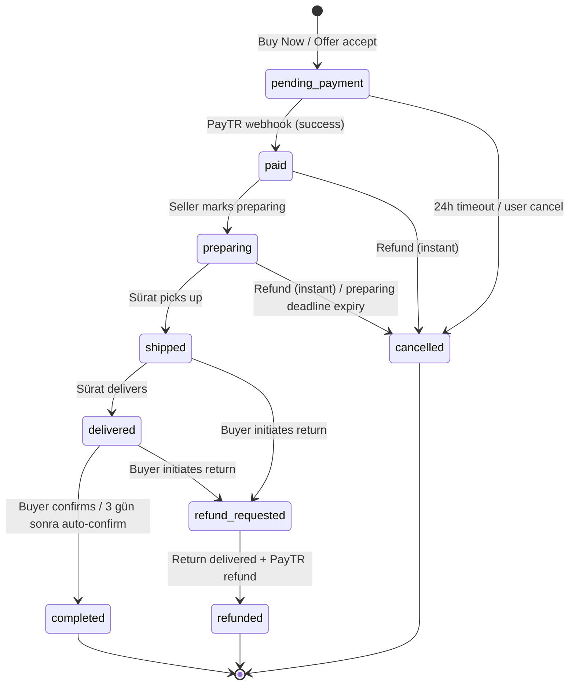
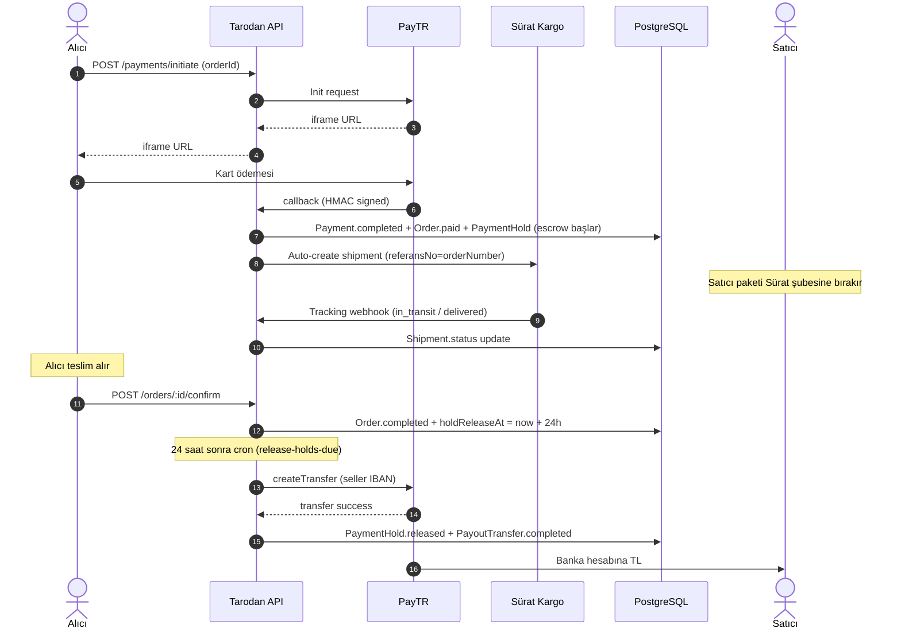
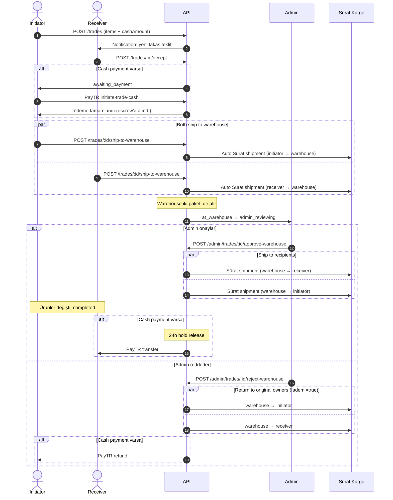
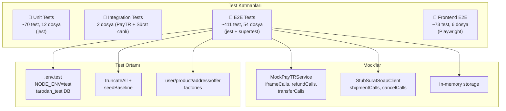

# Tarodan — Sistem Akış Diyagramları

Tarodan, koleksiyon araçları ve diecast modeller için **escrow korumalı**
e-ticaret + takas (swap) platformudur. Bu dokümanda kritik iş akışları
diyagramlarla anlatılmıştır. Üst seviye sistem mimarisi için
[`ARCHITECTURE.md`](./ARCHITECTURE.md) dosyasına bakın.

---

## 1. Yüksek Seviye Sistem Görünümü

```mermaid
flowchart LR
  subgraph Clients["🖥️  İstemciler"]
    Web["Web (Next.js)<br/>localhost:3000"]
    Admin["Admin Panel"]
  end

  subgraph API["⚙️  Backend API (NestJS 10)"]
    direction TB
    HTTP[REST + Express]
    Modules[44 Modül<br/>~450 endpoint]
    Cron[Schedulers<br/>(payment, shipping, refund)]
    Workers[BullMQ Workers]
  end

  subgraph Storage["💾  Storage"]
    PG[(PostgreSQL 17<br/>Prisma 5.22)]
    Redis[(Redis 7<br/>cache + queue)]
    ES[(Elasticsearch 8<br/>search)]
    S3[(AWS S3<br/>media)]
  end

  subgraph External["🌐  Dış Servisler"]
    PayTR["PayTR<br/>iframe + webhook + transfer"]
    Surat["Sürat Kargo<br/>SOAP + REST"]
    SMTP["SMTP<br/>(transactional email)"]
    Push["Expo Push"]
  end

  Web --> HTTP
  Admin --> HTTP
  HTTP --> Modules
  Modules --> PG
  Modules --> Redis
  Modules --> ES
  Modules --> S3
  Modules --> PayTR
  Modules --> Surat
  Modules --> SMTP
  Workers --> SMTP
  Workers --> Push
  Cron --> Modules
```

---

## 2. Sipariş Yaşam Döngüsü (Order State Machine)



---

## 3. Escrow ve Para Akışı



---

## 4. İade (Refund) Akışı — 3 Senaryo

```mermaid
flowchart TD
  Start([Alıcı 'İade Talebi Oluştur']) --> CheckStatus{Order.status<br/>+ 14 gün?}

  CheckStatus -->|paid / preparing<br/>(shipment=pending)| Instant
  CheckStatus -->|shipped / in_transit| Wait
  CheckStatus -->|delivered ≤14 gün| Cooling
  CheckStatus -->|delivered >14 gün| Dispute

  Instant[Anlık İade] --> InstantPayTR[PayTR refund]
  InstantPayTR --> InstantSurat[Sürat cancel]
  InstantSurat --> InstantStock[Stok +1, Order=cancelled]
  InstantStock --> EndR([Para alıcıya geri])

  Wait[wait_for_delivery] --> WaitDeliver{Ürün delivered?}
  WaitDeliver -->|hayır| WaitDeliver
  WaitDeliver -->|evet, cron tetikler| Return

  Cooling[Otomatik onay<br/>14 gün cayma hakkı] --> Return

  Return[Sürat'tan iade kargo<br/>Iademi=true<br/>RFD-YYYY-NNNNNN] --> ReturnDeliver{Sürat'tan delivered?}
  ReturnDeliver -->|hayır| ReturnDeliver
  ReturnDeliver -->|evet| FinalRefund[PayTR refund<br/>+ stok geri]
  FinalRefund --> EndR

  Dispute[pending_review] --> SellerDecide{Satıcı kararı}
  SellerDecide -->|kabul| Return
  SellerDecide -->|48h sessiz| AutoAccept[Auto-accept cron]
  AutoAccept --> Return
  SellerDecide -->|red, sebepli| AdminQ([Admin İncelemesi])
  AdminQ --> EndR
```

**14 gün cayma hakkı**: Türkiye Mesafeli Satış Sözleşmesi gereği, alıcı
ürünü teslim aldıktan sonra **14 gün içinde sebep göstermeden** iade hakkına
sahiptir. Satıcı bu talebi reddedemez (yasal koruma).

---

## 5. Takas (Trade) Akışı — Cash Trade



---

## 6. Test Mimarisi



**Test ortamı dış dünyaya hiç ulaşmaz** — PayTR ve Sürat mock'lanır,
S3 yerine in-memory stub, ayrı bir Postgres veritabanı (`tarodan_test`).
CI'da PostgreSQL 16 + Redis 7 + Elasticsearch 8 services olarak ayağa
kaldırılır.

---

## 7. CI / CD Pipeline

```mermaid
flowchart LR
  Dev[git push] --> CI[GitHub Actions]
  CI --> Build[Build]
  CI --> TC[Type Check]
  CI --> Lint[Lint]
  CI --> Unit[Unit Tests]
  CI --> E2E[E2E Tests<br/>(PG + Redis + ES servisleri)]
  CI -.optional.-> Int[Integration Tests<br/>(PayTR + Sürat canlı)]

  Build --> Pass{Hepsi ✓?}
  TC --> Pass
  Lint --> Pass
  Unit --> Pass
  E2E --> Pass
  Pass -->|evet| Green([✅ CI yeşil])
  Pass -->|hayır| Fail([❌ Build kırık])
```

`prisma generate` adımı **3 retry** ile sarılı: ECONNRESET gibi geçici
network hatalarına karşı dirençli. CI'da composite action kullanılıyor.
